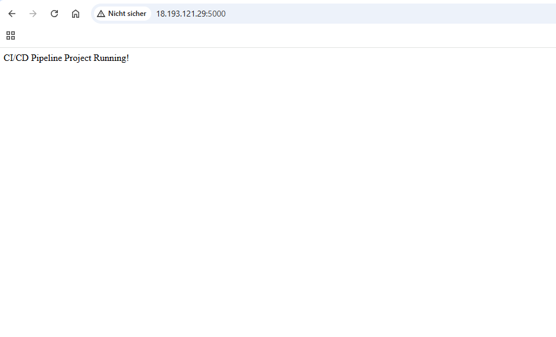
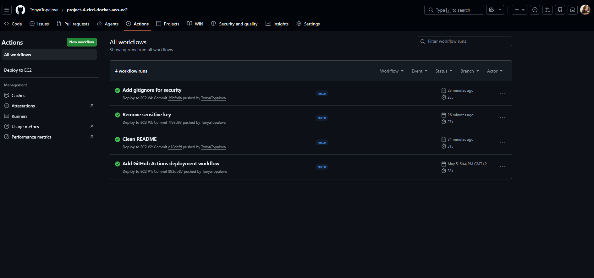
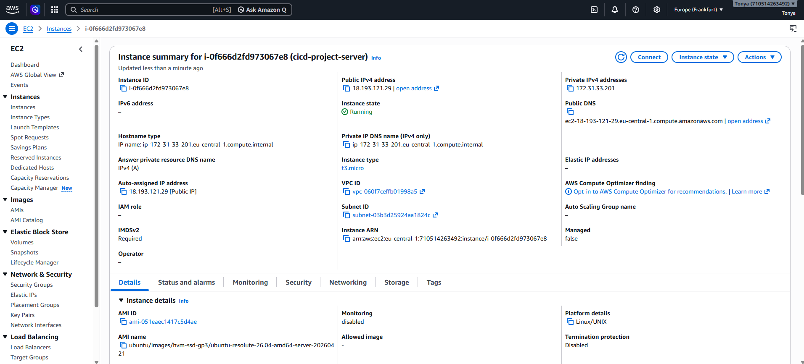

# CI/CD Pipeline with GitHub Actions, Docker and AWS EC2

## Project Overview

This project demonstrates a simple CI/CD pipeline for a Dockerized Flask application.

Whenever code is pushed to the main branch, GitHub Actions automatically connects to an AWS EC2 instance, pulls the latest code, rebuilds the Docker image, and restarts the application container.

## Technologies Used

- Python
- Flask
- Docker
- GitHub Actions
- AWS EC2
- SSH
- GitHub Secrets

## CI/CD Workflow

```text
Developer pushes code to GitHub
        ↓
GitHub Actions starts automatically
        ↓
GitHub connects to AWS EC2 via SSH
        ↓
EC2 pulls latest code
        ↓
Docker image is rebuilt
        ↓
Old container is stopped and removed
        ↓
New container is started
        ↓
Application is live
```

## Application

The Flask app runs on port `5000`.

Live URL:
http://18.193.121.29:5000

## What I Learned

- How to create a Dockerized Flask application
- How to set up an AWS EC2 instance
- How to use GitHub Actions for automated deployment
- How to use GitHub Secrets securely
- How to deploy applications with Docker and SSH
- Basic CI/CD pipeline concepts

## Project Structure

```text
.
├── .github
│   └── workflows
│       └── deploy.yml
├── app.py
├── Dockerfile
├── requirements.txt
└── README.md
```
## Screenshots

### Application Running


### GitHub Actions Success


### AWS EC2 Instance


## Author

Created as part of my Cloud / DevOps portfolio.